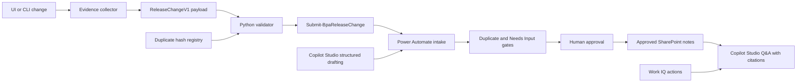

# BPA Release Note Agent

A public, synthetic reference implementation for turning evidence-backed
application changes into a validated release-change event. It demonstrates the
contract and submission boundary used by a release-note agent without exposing
organization data or requiring access to a Microsoft tenant.

## What This Repository Contains

- `ReleaseChangeV1` JSON Schema using Draft 2020-12
- `bpa-release-validate` Python CLI with canonical hash and duplicate checks
- `Submit-BpaReleaseChange` PowerShell module
- Loopback-only HTTP trigger mock and offline tests
- Synthetic User Note and Developer Note examples
- Sanitized Flow, Agent, Microsoft IQ, and demo documentation
- Privacy, gitleaks, Python, and Pester verification gates

Tenant credentials and deployment artifacts remain private. Sanitized
implementation evidence is summarized in
[docs/implementation-status.md](docs/implementation-status.md).

## Architecture



The public tests replace the HTTP trigger with a loopback mock. See
[docs/architecture.mmd](docs/architecture.mmd),
[docs/flow-contract.md](docs/flow-contract.md), and
[docs/microsoft-iq.md](docs/microsoft-iq.md) for the sanitized enterprise path.

## Setup

Prerequisites:

- Python 3.12
- PowerShell 7.4 or later
- Go, winget, or another method to install gitleaks 8.30.1

Install pinned dependencies:

```powershell
pwsh ./scripts/bootstrap.ps1
```

Run every acceptance check:

```powershell
pwsh ./scripts/verify.ps1
```

## Validate A Payload

```powershell
bpa-release-validate ./samples/release-change-workflow.json
```

Multiple payload paths form a batch. Repeated hashes return exit code `3`.

```powershell
bpa-release-validate first.json second.json
bpa-release-validate --registry accepted-hashes.json payload.json
```

CLI exit codes:

| Code | Meaning |
|---:|---|
| `0` | Valid and not duplicated |
| `2` | Schema or canonical hash validation failed |
| `3` | Duplicate hash found in the batch or registry |
| `4` | File, JSON, schema, registry, or command usage error |

The canonical SHA-256 input excludes only top-level `releaseId`, `timestamp`,
and `changeHash`. All remaining fields are serialized as sorted, compact JSON.

## Submit A Payload

```powershell
Import-Module ./src/SubmitBpaReleaseChange/SubmitBpaReleaseChange.psd1

Submit-BpaReleaseChange `
  -PayloadPath ./samples/release-change-workflow.json `
  -TriggerUrl 'https://example.invalid/release-trigger'
```

The module validates before sending. Plain HTTP is accepted only for loopback
tests; all other destinations must use HTTPS. It never prints the trigger URL
or request headers.

## Security Model

- Every committed example is synthetic.
- Evidence uses `artifact://` references rather than internal URLs.
- The privacy scan rejects email addresses, canonical GUIDs, tenant domains,
  credential assignments, private keys, and absolute user paths.
- Gitleaks scans both the current directory and committed history.
- Public history must be created from this clean repository, never by
  sanitizing or rewriting a private repository.
- Runtime tests communicate only with `127.0.0.1`.

## Five-Minute Demo

Use [docs/demo-runsheet.md](docs/demo-runsheet.md). It covers the validated
payload, approval, three published notes, Agent Q&A, Work IQ evidence, and CI
without exposing tenant details.

## Open Production Decisions

See [OPEN_QUESTIONS.md](OPEN_QUESTIONS.md). The repository does not invent
production authentication, trigger responses, durable storage, or approval
policy.

## License

MIT
